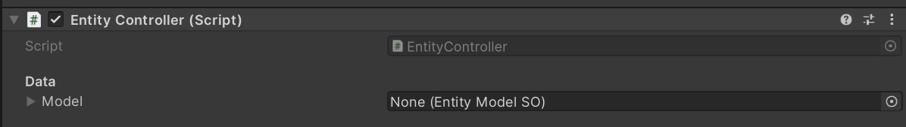
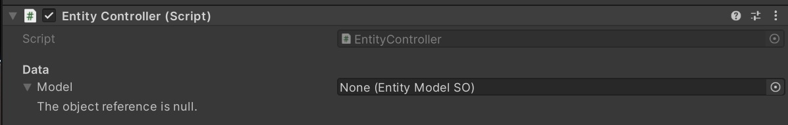
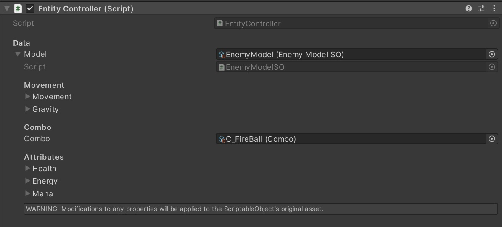
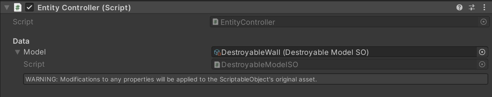

# Model Example
To define an entity's runtime logic, you create a **ModelSO** that inherits from `EntityModelSO`.
This acts as a blueprint for the entity, specifying which components should be created and added to the model at runtime.

### Typical Setup
1. Inherit from `EntityModelSO`.
2. Serialize data classes that describe components (`HealthComponentData`, `EnergyComponentData`, etc.).
3. Override `GetProxy()` to return a runtime `EntityModel<TModelSO>`.
4. Override `Init()` to add components into the model.

### Example
```csharp
[CreateAssetMenu(menuName = "Game/Entities/ExampleModel")]
public class ExampleModelSO : EntityModelSO
{
	[Header("Attributes")]
	[SerializeField] private HealthComponentData health;
	
	// Creates the runtime model using this ScriptableObject
	public override NullCheck<IModel> GetProxy()
	{
		return new NullCheck<IModel>(new EntityModel<ExampleModelSO>(this));
	}
	
	// Add components created from the serialized data
	public override void Init(in IController controller, in IModel model)
	{
		model.TryAddComponent(health.GetComponent());
	}
}
```

### Key points
- The `GetProxy()` method always returns a new `EntityModel<T>` where `T` is the concrete ModelSO type.
- In `Init()` you use `TryAddComponent()` to attach components to the runtime model.
- Serialized fields (`HealthComponentData`, `EnergyComponentData`, etc.) act as **blueprints** and have methods to create the real components.
- More complex models (like `PlayerModelSO`) can also build controllers (e.g., `MotionController`) or handlers (e.g., `ComboHandler`) before attaching them to the model.

# Controller and Model in the Inspector
The controller takes the reference of the `ModelSO` and when the game starts, creates and initializes the proxy for that entity.
Through a **custom property drawer**, the controller displays the model's parameters directly in the model with a dropdown. This means that you don't need to open the scriptable object each time you want to change a value.



If there is no **ModelSO** is looks like this.



You can use any **ModelSO** with any **Controller**, it shows the variables like this.

> [!NOTE] 
> I only shows **public** and **serialized** variables.

> [!WARNING] 
> Since it is a `ScriptableObject` any changes to it in **editor or runtime** will be changed in the **ModelSO**.

## More Examples
- [Controller Example](../Controller/Example%20Usage.md)
- [View Example](../View/Example%20Usage.md)
- Component Example

[← Previous Page](IModel.md) | [Next Page →](../View/EntityView.md)
